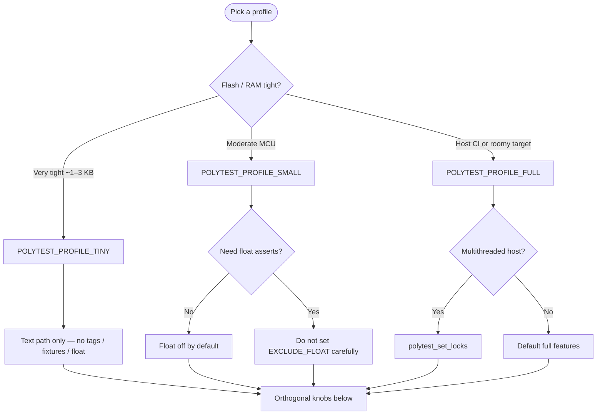

# Size profiles

PolyTest Core can strip features at compile time so the same harness fits a
hobby MCU (tiny) or a host CI binary (full).

## Choosing a profile



| Profile | Define | Typical size | Features |
|---------|--------|--------------|----------|
| **tiny** | `POLYTEST_PROFILE_TINY` | ~1–3 KB text | Text output only; no tags; no suite/group fixtures; no float; no longjmp |
| **small** | `POLYTEST_PROFILE_SMALL` | mid | Hierarchy + tags + fixtures + COBS (unless `POLYTEST_MINIMAL_PRINT`); float off by default; protect/abort OK |
| **full** | `POLYTEST_PROFILE_FULL` or unset | largest | Floats (unless `POLYTEST_EXCLUDE_FLOAT`), tags, hierarchy, COBS, protect, optional mutex hooks |

Derived macros (from `polytest_profile.h`):

- `POLYTEST_CFG_HAS_COBS`
- `POLYTEST_CFG_HAS_TAGS`
- `POLYTEST_CFG_HAS_FIXTURES`
- `POLYTEST_CFG_HAS_FLOAT`
- `POLYTEST_CFG_HAS_PROTECT`
- `POLYTEST_CFG_HAS_MUTEX`
- `POLYTEST_CFG_HAS_EXTENDED_ASSERTS` (string/memory/bits/arrays; off in tiny)
- `POLYTEST_CFG_HAS_HEAP` (when `POLYTEST_USE_HEAP`)

## CMake

```bash
cmake -S examples/host_c -B build/host_tiny \
  -DPOLYTEST_PROFILE=tiny -DPOLYTEST_MINIMAL_PRINT=ON
cmake -S examples/qemu_m33_smoke -B build/qemu_tiny \
  -DCMAKE_TOOLCHAIN_FILE=$PWD/examples/qemu_m33_smoke/toolchain-arm-none-eabi.cmake \
  -DPOLYTEST_PROFILE=tiny
```

Or `include(cmake/PolyTest.cmake)` after setting `POLYTEST_PROFILE`.

## Orthogonal knobs

| Knob | Effect |
|------|--------|
| `POLYTEST_MINIMAL_PRINT` | Force text path (no COBS) |
| `POLYTEST_EXCLUDE_FLOAT` | Drop float/double asserts |
| `POLYTEST_NO_LONGJMP` | PROTECT always succeeds; ABORT only sets fail |
| `POLYTEST_USE_HEAP` | Enable `polytest_register_heap_case` |
| `POLYTEST_USE_SECTION_REGISTRY` | Place cases in `.polytest_info` |
| `POLYTEST_FREESTANDING` | No stdio; set writer yourself |

!!! tip "Freestanding"
    On bare metal, call `polytest_set_writer` before `polytest_run_*` so events
    reach your UART / semihosting sink.

## Mutex hooks (full)

```c
void polytest_set_locks(polytest_lock_fn_t lock, polytest_lock_fn_t unlock, void *user);
```

When set, Core wraps assert fail-flag updates and writer emit. No-ops if NULL.
Intended for multithreaded **host** runners under the full profile.

## Heap registration

```c
#define POLYTEST_USE_HEAP
int polytest_register_heap_case(const char *suite, const char *group,
                                const char *name, polytest_fn_t fn);
```

Static ctor lists remain the default.

## Section registry (GNU ld)

Default discovery uses `__attribute__((constructor))`. For section-based
registration:

1. Compile with `-DPOLYTEST_USE_SECTION_REGISTRY`
2. Keep the section in the linker script:

```ld
.polytest_info : {
  PROVIDE(__start_polytest_info = .);
  KEEP(*(.polytest_info))
  PROVIDE(__stop_polytest_info = .);
} > FLASH
```

3. At run start, Core walks `__start_polytest_info` … `__stop_polytest_info`
   (GNU/Clang non-Apple). Host builds can keep the ctor path and omit the script.

## Size table (reference)

See [`examples/profile_sizes/README.md`](https://github.com/malto101/Open-PolyTest-Framework/blob/main/examples/profile_sizes/README.md)
for measured QEMU/host sizes after a local build.
